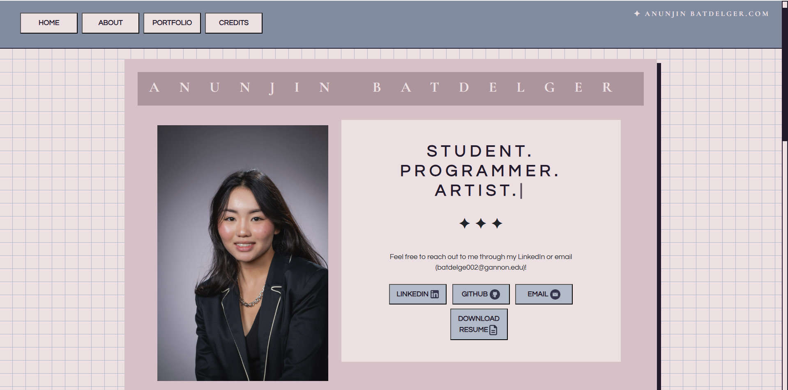

# Anunjin Batdelger Portfolio

A personal portfolio website showcasing my projects, skills, education, and contact information.

## 🚀 Live Demo
[View Portfolio](https://anunjinb.netlify.app)

## ✨ Features
- Responsive design
- Project showcase with images and videos
- Education, leadership, and awards section
- Contact section with LinkedIn, GitHub, and Email buttons

## 🛠️ Tech Stack
- HTML, CSS, JavaScript
- Bootstrap 5
- Ionicons

## 📦 How to Run Locally
1. Clone the repo:
   ```
   git clone https://github.com/anunjinb/portfolio.git
   ```
2. Open `index.html` in your browser.

## 📸 Screenshots


## 📬 Contact
- [LinkedIn](https://www.linkedin.com/in/anunjin-batdelger)
- [GitHub](https://github.com/anunjinb)
- Email: batdelge002@gannon.edu

---

Feel free to customize this template for your needs!
